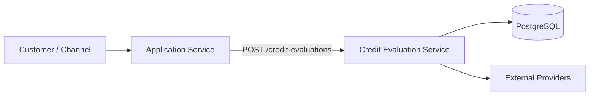
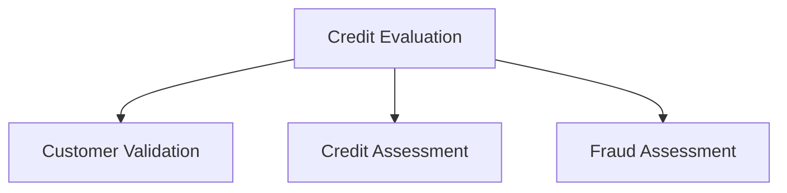
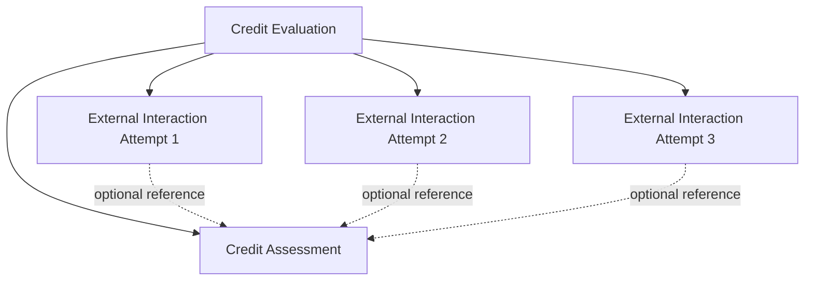

# Credit Evaluation Service — System Design

**Status:** Working design baseline  
**Last updated:** 2026-09-23

## 1. Purpose

The Credit Evaluation Service (CES) evaluates a loan application using the information supplied by the application-owning service, performs required customer, credit, and fraud assessments, and ultimately produces an evaluation decision.

This document captures the current finalized architecture decisions. Unresolved topics are intentionally listed separately and must not be treated as finalized design.

## 2. Service boundary

The Application Service owns the loan application lifecycle. CES owns the credit evaluation lifecycle.



CES is not the system of record for the live application. It stores the application information required for an evaluation as an evaluation-time snapshot.

## 3. Evaluation identity

Each evaluation has its own unique `evaluationId`. The evaluation ID identifies one evaluation lifecycle and is not reused as the identity of every internal object.

Assessments and external-service interactions have their own identifiers.

## 4. Initial evaluation request and application snapshot

The Application Service supplies the application data required for evaluation in the initial request to CES. CES persists the necessary evaluation-time application information with the evaluation.

The snapshot represents the information used by CES for that evaluation; it is not the live application record.

Conceptually:

```text
Application Service
        |
        | application data required for evaluation
        v
Credit Evaluation
        |
        +-- applicationId
        +-- customerId
        +-- loanProduct
        +-- requestedAmount
        +-- other evaluation-relevant fields
```

## 5. Evaluation status and business decision

Evaluation `status` and business `decision` are separate concepts.

- **Status** represents the current lifecycle/process state of the evaluation.
- **Decision** represents the business outcome, such as approval or rejection, once a decision is reached.

A technical processing failure must not automatically be represented as a business rejection.

## 6. Assessment model

Major evaluation components are represented by separate assessment concepts:



Each assessment has its own identity.

An assessment represents the normalized business/analytical result produced for that part of the evaluation. The exact assessment fields remain subject to the relevant provider contracts and risk/business rules.

## 7. Assessment data versus provider response

CES should not blindly persist an entire external provider response as business columns in an assessment table.

The assessment should contain normalized, decision-relevant information that CES actually uses. The complete external response and its retention requirements will be addressed as part of the finalized external-integration/audit design where required.

## 8. External service interaction

External communication is a separate concept from an assessment.

- **Assessment:** the business/analytical result used by CES.
- **ExternalServiceInteraction:** the communication evidence/history between CES and an external provider.

An interaction belongs to an evaluation and may optionally reference an assessment. If an interaction references an assessment, the referenced assessment must belong to the same evaluation.

A single logical external operation may have multiple physical communication attempts.



## 9. Interaction evidence

The interaction record should preserve durable evidence needed to understand what CES observed, including relevant timestamps and failure information.

Conceptual evidence includes:

- `startedAt`
- `requestSentAt`
- `responseReceivedAt`
- `failedAt`
- failure stage
- failure type
- provider/operation information
- operation reference where applicable

Detailed technical diagnostics such as stack traces belong primarily in operational logs/traces rather than arbitrary business columns.

## 10. Communication state

Communication state describes what CES observed about its own communication with the external provider.

The currently agreed controlled values are:

```text
NOT_STARTED
CONNECTING
REQUEST_SENT
WAITING_FOR_RESPONSE
RESPONSE_RECEIVED
FAILED
```

These values are intended to be represented as a controlled enum in the application model.

## 11. Provider operation outcome

Provider operation outcome describes what CES knows about the provider-side operation.

The currently agreed controlled values are:

```text
UNKNOWN
PROCESSING
COMPLETED
FAILED
NOT_ACCEPTED
```

This is intentionally separate from communication state.

For example:

```text
Communication state = FAILED
Failure type        = READ_TIMEOUT
Provider outcome    = UNKNOWN
```

This means CES failed to receive a response in time; it does not prove that the provider failed to process the operation.

## 12. Timeout semantics

A timeout after a request has been sent is not automatically a provider failure.

CES may know that:

1. a connection was established,
2. the request was sent,
3. CES waited for a response, and
4. the response was not received within the configured timeout.

CES may still be unable to determine whether the provider processed the operation.

Therefore:

```text
TIMEOUT != CONFIRMED_PROVIDER_FAILURE
```

## 13. Unknown outcome

`UNKNOWN` means CES has recorded the relevant evidence available to it, but the provider-side business outcome cannot yet be determined.

It does not mean that CES failed to record what happened.

Example:

```text
REQUEST_SENT
    ↓
WAITING_FOR_RESPONSE
    ↓
READ_TIMEOUT
    ↓
Provider outcome = UNKNOWN
```

## 14. Retry principle

Retry is not a generic exception handler.

CES must evaluate the observed communication state, available provider outcome, provider semantics, and idempotency/reconciliation capabilities before deciding whether another attempt is safe.

The detailed retry policy is not yet finalized.

## 15. Reconciliation principle

When an external operation has an unknown provider outcome, reconciliation/status lookup is the preferred conceptual mechanism when the provider supports it.

```text
UNKNOWN
   ↓
Provider reconciliation/status query
   ↓
Known provider outcome
```

The complete reconciliation architecture is not yet finalized.

## 16. Idempotency principle

Idempotency is a required consideration for retrying external operations. A stable logical operation reference/idempotency key should be used where supported by the provider so that a retry does not unintentionally create duplicate business processing.

The final provider-specific idempotency contract is not yet finalized.

## 17. Current conceptual domain model

```text
CreditEvaluation
    |
    +-- CustomerValidation
    +-- CreditAssessment
    +-- FraudAssessment
    +-- ExternalServiceInteraction*
```

`*` indicates that multiple interaction records may exist for attempts/history.

## 18. Open architectural decisions

The following topics are deliberately not finalized yet:

- exact PostgreSQL schema and constraints
- exact REST request/response contracts
- exact assessment fields
- external provider contracts
- final idempotency implementation
- retry policy
- reconciliation implementation
- Kafka/event architecture
- recovery after CES restart
- customer-validation integration
- fraud integration
- risk-rule/risk-engine architecture
- final decision algorithm
- security architecture
- observability architecture
- deployment, HA, and DR architecture

These must be decided and documented before implementation of the affected area.

## 19. Implementation boundary

The separate `CES implementation` workspace implements the finalized decisions recorded in this repository. If implementation reveals a genuine architectural problem, the design must be revisited and the resulting change documented as a new or superseding architecture decision rather than silently changing the implementation contract.

## 20. Related decisions

See the ADRs under `docs/decisions/` for the rationale and history behind significant architecture decisions.
